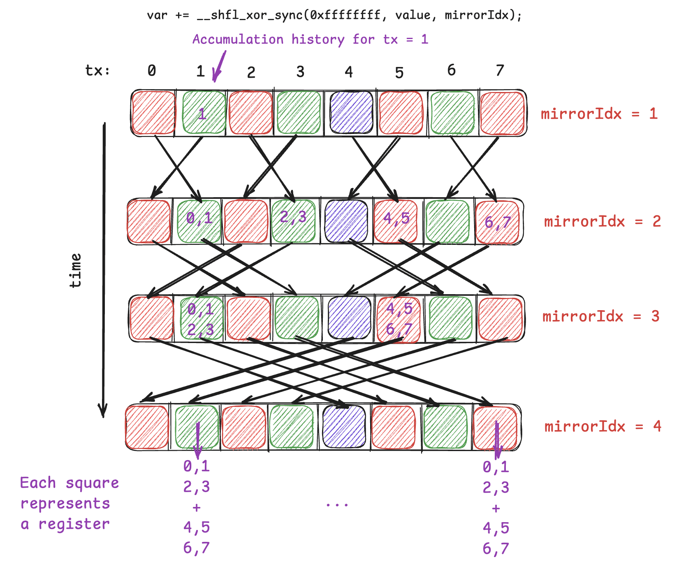

### Warp Shuffling

Warp shuffling is a warp-level primitive, which means operations that are executed between threads of a warp. Particularly, warp shuffling is done by exchanging values from the registers of threads **within a warp**. To achieve shuffling, we define a unsigned mask, which determines which threads of the warp will participate inside that warp-level reduction primitive. An example use is the following intrinsic:
```c
__shfl_down_sync(0xffffffff, var, offset);
```

Intrinsic is just a cool way of saying that it is a direct hardware instruction. Mostly specified by the two underscores '__'.

When a thread comes to execute this line, it will look to the thread at 'offset' distance from it and take their 'var' value, assuming 'var' is a defined variable inside the threads' registers.

Note that shfl_down_sync is synchronous, meaning that all threads must arrive to this state before shuffling could begin.

A common mistake is to implement the reduction algorithm for the warp-level primitive the same as a normal shared memory reduction algorithm. Here is the wrong implementation first:

```c
//
// WRONG IMPLEMENTATION
//
for (uint stride = 16; stride > 0; stride >>= 1) {
        if (tid < stride)
            threadVal += __shfl_down_sync(FULL_MASK, threadVal, stride);
    }
```

The problem here is the if condition. In the first loop, threadIdx.x (tid) = 0-15 will pass but tid = 16-31 will not. Since warp shuffling is synchronous, the first group of tids will wait and the loop will stall indefinitely!

To fix this, we only have to remove the if statement. We do not have to worry about 'out-ouf-bounds' memory access since we simply do not work with memory! We work with threads at a register level. If a thread tries to access a thread index that is ofsetted outside the warp, nothing happens, **it returns the calling thread's own value**. **However**, if the calling thread tries to read data from source thread that is not actively participating in shuffle, then it would cause undefined behaviour (UB). Here is the corrected code:

```c
//
// CORRECT IMPLEMENTATION :)
//

// Assume our array is already stored inside the registers of 32 threads.
for (uint stride = 16; stride > 0; stride >>= 1) {
        threadVal += __shfl_down_sync(FULL_MASK, threadVal, stride);
    }
```

Note that stride is always 16 since the whole array will be stored inside the registers of 32 threads and thus our array must be either:

* of size 32 OR
* reduced to size 32. 

For simplicity we take it as size 32.

Lets look at an example when array_size (d) > 32. For We have a simple solution as given:

```c
// A is an array of size d

int tid = threadIdx.x;
float threadVal = 0.0f;

// Reduce the total size of array to 32 by storing every value inside registers
for (uint offset = 0; offset < d; offset += 32) {
    // Failsafe if d is not a multiple of 32
    if (tid + offset < d)
        threadVal += A[tid + offset];
}

// Now A is reduced to the 32 threads inside registers!
// FULL_MASK = 0xffffffff
for (uint stride = 16; stride > 0; stride >>= 1) {
    threadVal += __shfl_down_sync(FULL_MASK, threadVal, stride);
}

// write result back
if (tid == 0) A[0] = threadVal;
```

As long as we are able to reduce/squeeze the whole array inside 32 registers, we are safe :)

NOTE: I've checked CUDA programming and a few discussions and unfortunately couldn't really pinpoint to why request of the calling thread for the source thread that has a mask of 0 is not ignored. The guide [Using CUDA Warp-Level Primitives](https://developer.nvidia.com/blog/using-cuda-warp-level-primitives/) also overlooks this fact in Listing 3.

### ANOTHER IMPLEMENTATION: __shfl_xor_sync(...)

Above we demonstrated a reduction algorithm using __shfl_down_sync. In the case that we want each thread within a warp to share the same reduced value, we use the __shfl_xor_sync intrinsic. It works in a similar manner to the preceding, except now instead of ofsetting from calling thread, we do a mirroring with respect to the position of the calling thread and a distance from it. This is actually a bitwise XOR operation but I like to think of it as a mirroring index. This is quite hard to image but seeing how the mirroring index moves and carries the summation through out its function becomes more apperant if we draw it out:



It is most simple if you follow the first thread (tx = 0) and see the accesses and then generalize it over other threads. A more natural and convincing proof follows from writing each thread idx and mirror idx in two's complements and doing the bitwise XOR yourself.

### XOR Implementation (rowSum)

I wrote a rowSum kernel that is suitable for all matrix sizes. It uses block-row tiling, butterfly all-reduce and warp-uniform branching to prevent warp divergence. 

The idea is to group BN many warps in a block to work on BN many rows of a matrix of size N x d. It is a parallelized version of the above algorithm where each block is ofsetted to their respective row by moving pointers with B += blockIdx.x * BN * d; and then making each row in the block be reduced to each corresponding warp. Then XOR shuffle intrinsic described above is used to do a all-reduce reduction. 

There are two if statements (boundary checks) wrapped in the kernel to prevent inactive threads from participating. Since a row consists of only a single warp, there is no way that the boundary check for rows can cause warp divergence. That is because either all threads within a warp are participating or neither are. To verify against cpu, I have decided to make each first thread of a row write its own reduced sum back to that row's first entry, though that can be changed according to your goals.