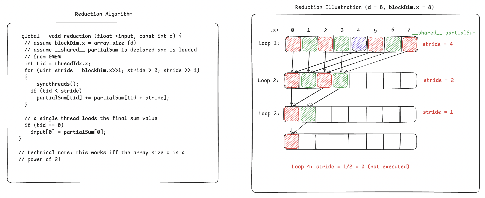

# CUDA Experiments
I hope to shape this repo into a collection of projects that helped me learn CUDA.

## CUDA Fundamentals
With CUDA Fundamentals, I hope to explore the fundamentals of CUDA programming. I plan to implement basic kernels and slowly ramp it up and see where it goes.

Kernels implemented so far:
- [x] Reduction Algorithm: from PMPP
- [ ] Reduction Algorithm: Warp Shuffling
- [ ] build.sh file to run launch command (later)

#### LAUNCH COMMANDS

Move into desired kernel directory, e.g:

```
cd cuda-experiments/01_naiveReduction
```

Launch using nvcc:

```
nvcc -I../common main.cu reduction.cu ../common/utils.cu -o test_run
```

#### To-Do:

* Implement matrix row reduction
* Explore alternatives for reductions including warp shuffling

### Reduction Algorithm

Reduction algorithm's are used to extract a single value from an array. Generally speaking, with proper index mapping, it can be also applied to matrices and then a rowSum or a rowMax can be achieved. However, the idea after it is to utilize the most threads within a warp to reduce **warp divergence**. That is, a warp (32 threads) following the same control path is much more favorable then some of it executing one part and the rest of it another part (seen most commonly in if-else control statements). Warp divergence can in turn increases the overhead time.

Here is the algorithm with a small size illustration I made:



I hope that this makes everything obvious and if not:

Stride is a global offset index and the goal is to enable every thread to contribute in the partial sum. Every thread adds two elements and so at every loop the size is halved, thus the necessary amount of thread will be halved too. The number of threads that will work to compute d elements is d/2, which will be equal to stride at every point in the loop. To ensure that, we introduce an if statement (tid < stride) inside the loop and after each write, we do a __syncthreads() call to ensure all threads finish their sum before looking into each others values. Otherwise a race condition occurs. By the way, one thing I missed while making this illustration is that you can actually launch half the array size of threads since in the first loop already half of the threads are not being used. Or even better, you can do the first reduction while loading it from GMEM to SMEM. Say the array size is 64, then while uploading to SMEM, let each thread fetch 2 data with a stride of 32 and load to SMEM by adding those two. Then the SMEM size will be 32, much smaller, and the 32 threads than can finish up the reduction with the above algorithm.

### Warp Shuffling

Warp shuffling is a warp-level primitive, which means operations that are executed between threads of a warp. Particularly, warp shuffling is done by exchanging values from the registers of threads **within a warp**. To achieve shuffling, we define a unsigned mask, which determines which threads of the warp will participate inside that warp-level reduction primitive. An example use is the following intrinsic:
```c
__shfl_down_sync(0xffffffff, var, offset);
```

Intrinsic is just a cool way of saying that it is a direct hardware instruction. Mostly specified by the two underscores '__'.

When a thread comes to execute this line, it will look to the thread at 'offset' distance from it and take their 'var' value, assuming 'var' is a defined variable inside the threads' registers.

Note that shfl_down_sync is synchronous, meaning that all threads must arrive to this state before shuffling could begin.

A common mistake is to implement the reduction algorithm for the warp-level primitive the same as a normal shared memory reduction algorithm. Here is the wrong implementation first:

```c
//
// WRONG IMPLEMENTATION
//
for (uint stride = 16; stride > 0; stride >>= 1) {
        if (tid < stride)
            threadVal += __shfl_down_sync(FULL_MASK, threadVal, stride);
    }
```

The problem here is the if condition. In the first loop, threadIdx.x (tid) = 0-15 will pass but tid = 16-31 will not. Since warp shuffling is synchronous, the first group of tids will wait and the loop will stall indefinitely!

To fix this, we only have to remove the if statement. We do not have to worry about 'out-ouf-bounds' memory access since we simply do not work with memory! We work with threads at a register level. If a thread tries to access a thread index that is ofsetted outside the warp, nothing happens, **it returns the calling thread's own value**. **However**, if the calling thread tries to read data from source thread that is not actively participating in shuffle, then it would cause undefined behaviour (UB). Here is the corrected code:

```c
//
// CORRECT IMPLEMENTATION :)
//

// Assume our array is already stored inside the registers of 32 threads.
for (uint stride = 16; stride > 0; stride >>= 1) {
        threadVal += __shfl_down_sync(FULL_MASK, threadVal, stride);
    }
```

Note that stride is always 16 since the whole array will be stored inside the registers of 32 threads and thus our array must be either:

* of size 32 OR
* reduced to size 32. 

For simplicity we take it as size 32.

Lets look at an example when array_size (d) > 32. For We have a simple solution as given:

```c
// A is an array of size d

int tid = threadIdx.x;
float threadVal = 0.0f;

// Reduce the total size of array to 32 by storing every value inside registers
for (uint offset = 0; offset < d; offset += 32) {
    // Failsafe if d is not a multiple of 32
    if (tid + offset < d)
        threadVal += A[tid + offset];
}

// Now A is reduced to the 32 threads inside registers!
// FULL_MASK = 0xffffffff
for (uint stride = 16; stride > 0; stride >>= 1) {
    threadVal += __shfl_down_sync(FULL_MASK, threadVal, stride);
}

// write result back
if (tid == 0) A[0] = threadVal;
```

As long as we are able to reduce/squeeze the whole array inside 32 registers, we are safe :)

NOTE: I've checked CUDA programming and a few discussions and unfortunately couldn't really pinpoint to why request of the calling thread for the source thread that has a mask of 0 is not ignored. The guide [Using CUDA Warp-Level Primitives](https://developer.nvidia.com/blog/using-cuda-warp-level-primitives/) also overlooks this fact in Listing 3.

## Worklog

For now, I worked on organizing my github and getting comfortable with .cu and .cuh. I experimented with launch commands using flags and I think this workflow will keep everything much more clearer. Especially having a template is great since any local changes to the kernel doesn't affect the previous kernels I wrote. With this, I hope that I can create benchmarking functions that can work with multiple kernels :)
