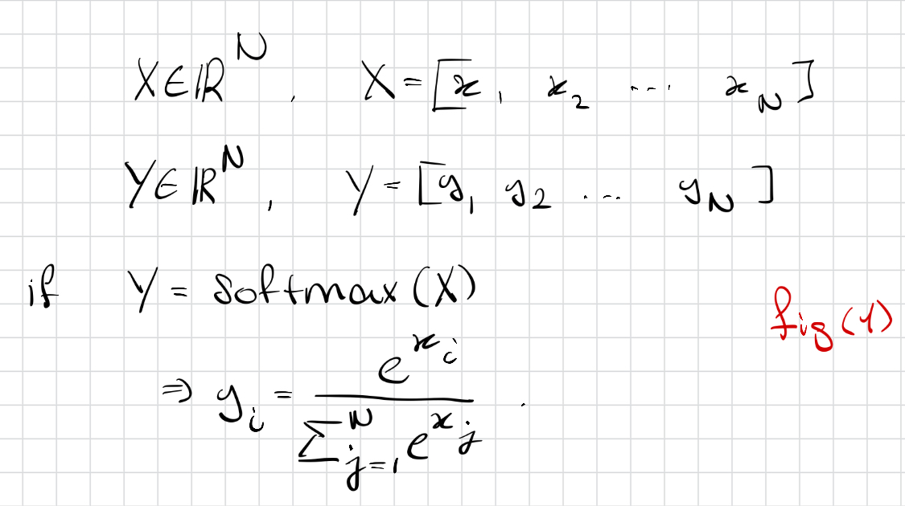
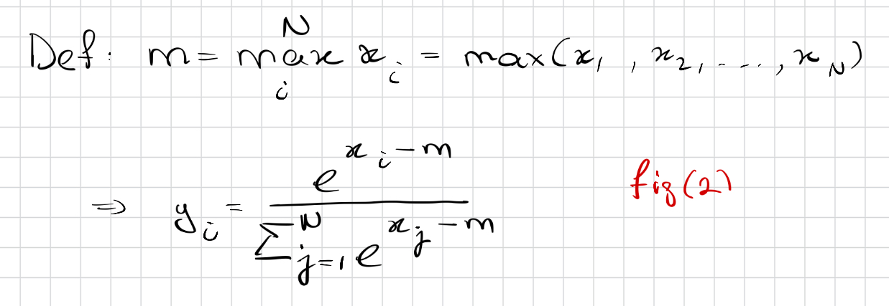
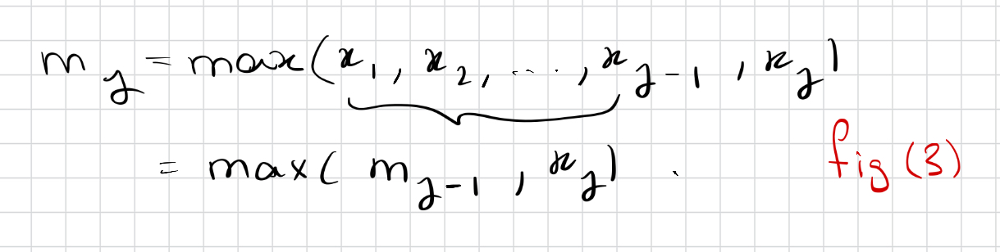
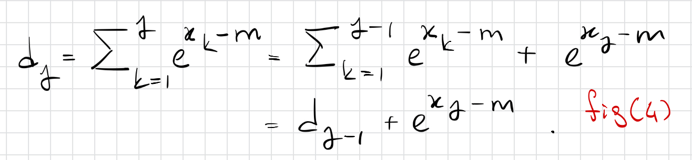
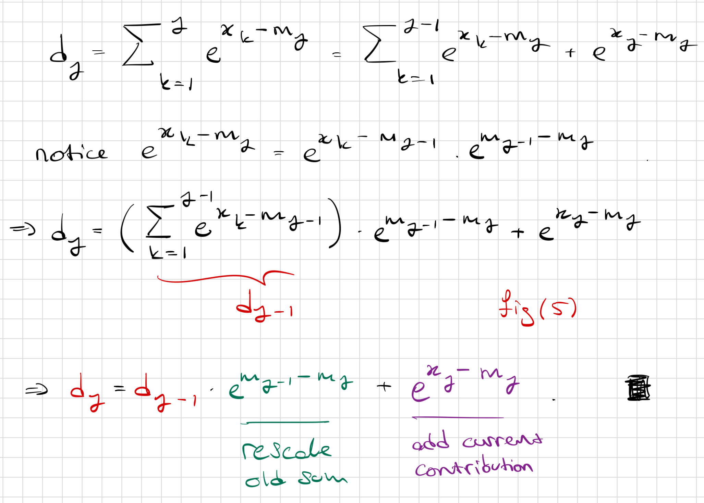

# Online Softmax

For reference, I included the formula of softmax.

Before we jump onto online softmax, we need to stop and notice that exponential values can get large very quickly and can also surpass the limit of representable numbers in computers. We call that overflow. To prevent this, we only have to subtract every x_i by m, the maximum value of the row vector, before raising it to the power of e. This is a numerically stabke method to calculate softmax. It essentially dampens the effect of each vector, relatively, without disturbing the ratio between every element of the vector. We then again calculate the denominator, and thus our 'safe softmax' formula is:

## Safe Softmax - CPU Algorithm

To calculate 'safe softmax' in a CPU, we first have to find the maximum value. We denote the maximum value of all elements up to vector element j as m_j. Thus m_N is the maximum value of vector X. We find these by iterating over all elements of X. We define m_j recursively as:

After we find m_N, we can begin with calculating the sum. We denote the sum of all elements up to vector element j as d_j. So d_N is the sum of all elemements in the vector. Similarly, we define d_j recursively as:

After we find the sum and maximum value, we can begin to write the final values y_i using the safe softmax definition, again by iterating over all elements of X. This yields the following CPU algorithm:

1. $\mathrm{m_0} \leftarrow -\infty$
1. **for** $k \leftarrow 1,N$ **do**
   1. $\mathrm{m_k} \leftarrow \mathrm{max(m_{k-1}, x_k)}$
1. **end for**
1. $\mathrm{d_0} \leftarrow 0$
1. **for** $j \leftarrow 1,N$ **do**
   1. $\mathrm{d_j} \leftarrow \mathrm{d_{j-1}+e^{x_j-m_N}}$
1. **end for**
1. **for** $i \leftarrow 1,N$ **do**
    1. $\mathrm{y_i} \leftarrow \mathrm{\frac{e^{x_i-m_N}}{d_N}}$
1. **end for**

## Online Softmax - CPU Algorithm

In online softmax we combine the calculation of m_j and d_j inside a single for loop. Notice that d_j is calculated by d_{j-1} and the current element. However, now instead of subtracting m_N, we subtract the current (running) maximum, m_j, from our element. This means that we have subtracted m_{j-1} when calculating d_{j-1}. To obtain d_j, we have to rescale d_{j-1} by $\mathrm{e^{m_{j-1}-m_j}}$ and add our current element contribution $\mathrm{e^{x_j-m_j}}$.

This recursive expression can be expressed in CPU code as below:

1. $\mathrm{m_0} \leftarrow -\infty$
1. $\mathrm{d_0} \leftarrow 0$
1. **for** $j \leftarrow 1,N$ **do**
   1. $\mathrm{m_j} \leftarrow \mathrm{max(m_{j-1}, x_j)}$
   1. $\mathrm{d_j} \leftarrow \mathrm{d_{j-1} (e^{m_{j-1}-m_j}) +e^{x_j-m_j}}$
1. **end for**

1. **for** $i \leftarrow 1,N$ **do**
    1. $\mathrm{y_i} \leftarrow \mathrm{\frac{e^{x_i-m_N}}{d_N}}$
1. **end for**

A simple proof that d_j can be expressed recursively only using d_{j-1}, x_j, m_j and m{j-1} is given below:

Note also that at the final iteration, d_N and m_N are still the final normalization and maximum values. It is best to write it out yourself and see that it indeed does work. If you are curious the formal proof is made by induction and can easily be viewed [here!](https://arxiv.org/abs/1805.02867)